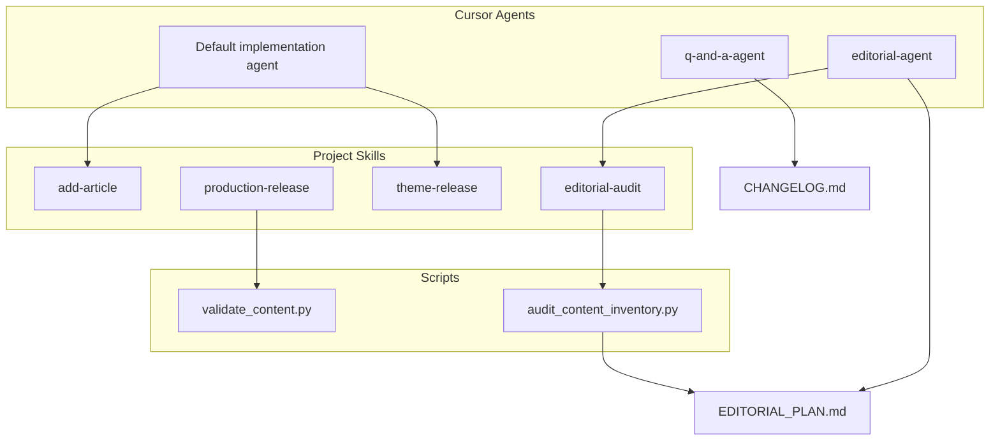

# Agent System

**Version:** 1.0  
**Last reviewed:** 2026-06-06  
**Scope:** Cursor agents, project skills, and delegation for the Prompt Anatomy Blog repo

Related: [AGENTS.md](../AGENTS.md) · [docs/EDITORIAL_PLAN.md](EDITORIAL_PLAN.md) · [docs/definition_of_done_system.md](definition_of_done_system.md)

---

## Architecture

---

## When to use which agent

| Task | Agent | Skill (optional) |
|------|-------|------------------|
| New or edited article | Default implementation agent | `add-article` |
| Editorial audit, taxonomy, plan refresh | **editorial-agent** | `editorial-audit` |
| Theme / CSS / templates | Default implementation agent | `theme-release` |
| Production deploy / release | Default implementation agent | `production-release` |
| How does X work? CHANGELOG, design-system docs | **q-and-a-agent** | — |

**Delegation:** editorial findings → **editorial-agent** updates EDITORIAL_PLAN; material process/doc changes → **q-and-a-agent** updates CHANGELOG.

---

## Agent definitions

| Agent | File | Owns |
|-------|------|------|
| q-and-a-agent | [`.cursor/agents/q-and-a-agent.md`](../.cursor/agents/q-and-a-agent.md) | Q&A, CHANGELOG, DESIGN_SYSTEM / COMPONENT_MAP / VISUAL_QA / AGENT_SYSTEM |
| editorial-agent | [`.cursor/agents/editorial-agent.md`](../.cursor/agents/editorial-agent.md) | Corpus audits, EDITORIAL_PLAN §2/§5, credibility recommendations |
| Default implementation agent | [AGENTS.md](../AGENTS.md) | Code, content, theme, `data/*.yaml`, validation evidence |

---

## Project skills

Located in [`.cursor/skills/`](../.cursor/skills/) — shared with all contributors using this repo.

| Skill | Path | Triggers |
|-------|------|----------|
| add-article | `.cursor/skills/add-article/` | New post, edit `content/articles/` |
| editorial-audit | `.cursor/skills/editorial-audit/` | Audit, quarterly refresh, editorial status |
| theme-release | `.cursor/skills/theme-release/` | Theme/CSS/template change |
| production-release | `.cursor/skills/production-release/` | Deploy, release, production smoke |

---

## Cursor rules (file-scoped)

| Rule | Globs | Role |
|------|-------|------|
| `project-core.mdc` | always | Stack, validate gate, agent roster pointer |
| `editorial-plan.mdc` | `content/articles/**`, editorial docs | Backlog, category rules before writing |
| `design-system.mdc` | `theme/**`, DESIGN_SYSTEM | Tokens, CSS conventions |
| `pelican-architecture.mdc` | content, pelicanconf, theme | Content/template boundaries |
| `deploy-vercel.mdc` | vercel, publishconf, DEPLOY | Deploy settings |

---

## Automation

| Command | Purpose |
|---------|---------|
| `make validate` | Theme tokens, brand sync, content frontmatter |
| `make audit-content` | Write `docs/reports/editorial-status-YYYY-MM-DD.md` |
| `python scripts/audit_content_inventory.py --json` | Machine-readable editorial inventory |

Cluster definitions: [data/editorial_clusters.yaml](../data/editorial_clusters.yaml)

---

## Phase 2 (deferred)

Popularity tracking via manual CSV in `data/analytics/` — see EDITORIAL_PLAN and editorial-agent charter.
