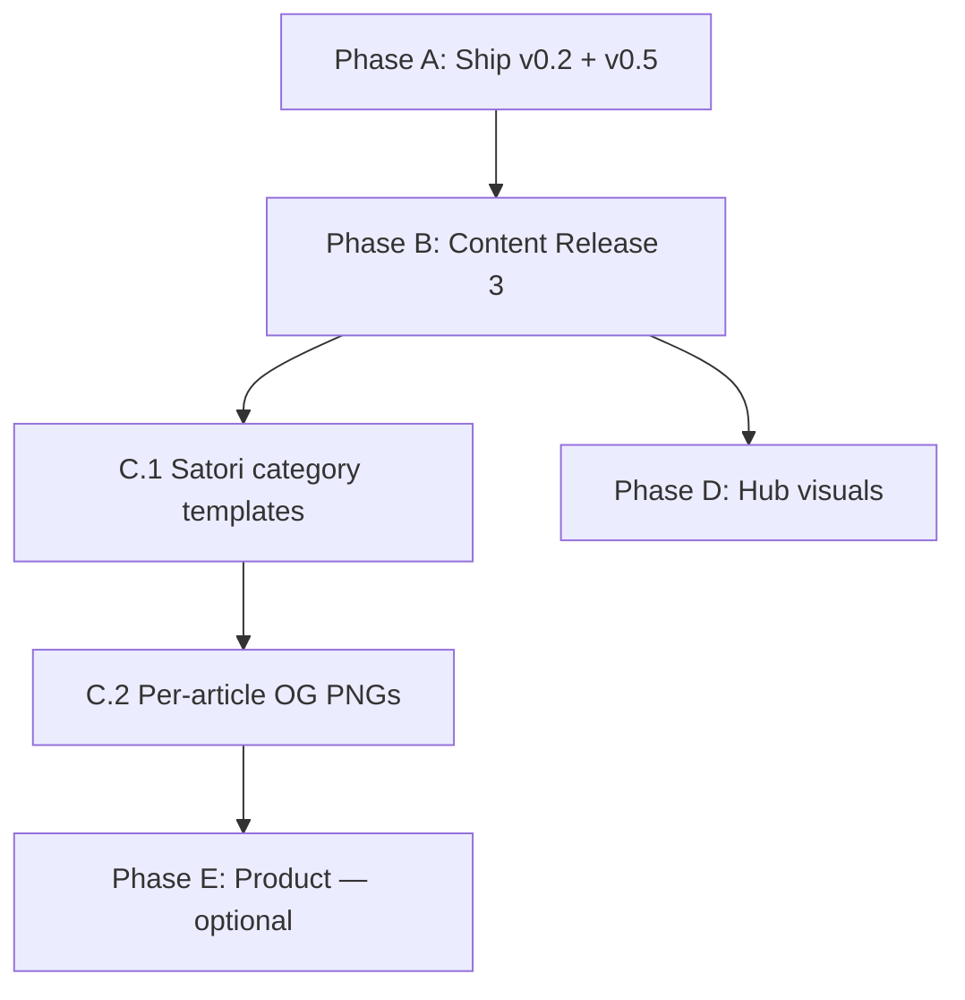

# Prompt Anatomy Blog — Roadmap & TODO

Living backlog for **promptanatomy.blog**. Update checkboxes as work completes; mirror release notes in [`CHANGELOG.md`](CHANGELOG.md).

**Last reviewed:** 2026-06-04  
**Current baseline:** v0.6.0 shipped (tag `v0.6.0`); B.1 + B.2 + B.3 complete. Next: Phase B.4 draft hygiene, Phase C Satori templates.

---

## How to use this file

| Symbol | Meaning |
|--------|---------|
| `[ ]` | Not started |
| `[~]` | In progress |
| `[x]` | Done |
| **P0** | Blocker / ship first |
| **P1** | High editorial or brand impact |
| **P2** | Scalability / polish |
| **P3** | Optional / when asked |

**Pre-ship gate (every phase):**

```bash
npm run build:satori          # if illustrations or data/og/ changed
python scripts/validate_satori_manifest.py
python scripts/validate_theme_tokens.py
python scripts/validate_content.py
python scripts/sync_illustrations.py
python -m pelican content -s publishconf.py
python scripts/verify_build_assets.py
# Preview: python -m http.server 8000 --directory output
```

On Windows without `make`, run the commands above in order (see [`docs/DEPLOY.md`](docs/DEPLOY.md)).

---

## Completed (reference)

- [x] **v0.2.0 — Content upgrade:** pillar rewrites, draft merges, governance Northline thread, Release 2 validation gates, hub/llms updates.
- [x] **v0.5.0 — Satori Phase 1:** five article heroes (1600×900), `og-default.png` (1200×630), `data/og/` pipeline, build wiring, docs.
- [x] **Start-here pillars:** `the-model-is-not-the-system`, `10-signs-your-company-is-vibe-prompting`, `how-to-design-an-ai-agent-workflow` — 1,200+ words, `hero_caption`, FAQ where required.

---

## Phase A — Ship baseline (P0)

**Goal:** Production reflects local v0.2.0 + v0.5.0 work.  
**Target tag(s):** `v0.2.0`, `v0.5.0` (or single combined release — pick one convention and stick to it).

### A.1 Git & release

- [x] Review diff; exclude secrets, `.env`, `__pycache__`, accidental `output/` commits.
- [x] Stage and commit: content, `data/og/`, `data/01_illustrations/Satori/*.png`, scripts, `package.json`, theme, docs, `CHANGELOG.md`.
- [x] Tag release(s) and push to `main` (`v0.5.0` single tag).
- [x] Confirm Vercel build succeeds (`scripts/vercel_build.sh` runs `build:satori`).

### A.2 Production smoke test

- [x] Home `/` — hub sections, featured card, start-here cards.
- [x] Five Satori articles (heroes + captions):
  - [x] `/articles/what-is-context-architecture/`
  - [x] `/articles/case-study-vibe-prompting-to-structured-workflow/`
  - [x] `/articles/structured-prompt-system-blueprint/`
  - [x] `/articles/multi-agent-handoff-pattern/`
  - [x] `/articles/from-prompts-to-business-outcomes/`
- [x] Fallback OG: `https://www.promptanatomy.blog/static/img/og-default.png` → 200.
- [ ] Optional: Facebook/Twitter/LinkedIn card debuggers on flagship pillar.

### A.3 MWB sign-off ([`AGENTS.md`](AGENTS.md))

- [x] Home hub sections render from YAML.
- [x] Article typography / code blocks OK.
- [x] `/about/` live.
- [x] Atom feed `/feeds/all.atom.xml`.
- [x] `validate_content.py` passes (warnings OK; zero errors).
- [x] Vercel production `SITEURL` / canonical www correct.

---

## Phase B — Content Release 3 (P1)

**Goal:** Published catalog reads as a knowledge hub, not a slide archive.  
**Target release:** `v0.6.0`  
**Validator source of truth:** `python scripts/validate_content.py` (warnings below as of 2026-06-04).

### B.1 Framework depth (900+ words)

Expand prose-first; add decision criteria, one composite example, 2–4 internal links each. Set `body_locked: true` after edit.

| Slug | ~Words | Priority | Notes |
|------|--------|----------|-------|
| `memory-types-for-ai-systems` | 209 | P1 | On Framework reading path |
| `structured-prompt-system-blueprint` | 233 | P1 | Registry example exists; expand narrative |
| `evaluation-hooks-for-ai-workflows` | 294 | P1 | Sample YAML exists; expand |
| `ai-implementation-maturity-ladder` | 264 | P1 | On Framework reading path |
| `prompt-anatomy-foundations` | 174 | P2 | **Nav index** — expand lightly or document as intentional short hub page |

**Done when:** no `framework article short` warnings for P1 slugs (except foundations if kept as nav). **[x] Done (v0.6.0)** — P1 expanded; `prompt-anatomy-foundations` exempt via `content_tier: nav`.

### B.2 `hero_caption` sweep (published)

Add one-line figcaptions (what the diagram *means*, not title repeat).

| Slug | Status |
|------|--------|
| `ai-implementation-maturity-ladder` | [x] |
| `context-window-myths` | [x] |
| `handoff-rules-between-humans-and-ai` | [x] |
| `memory-types-for-ai-systems` | [x] |
| `multi-agent-handoff-pattern` | [x] |
| `prompt-anatomy-ecosystem-map` | [x] |
| `prompt-engineering-vs-ai-workflow-engineering` | [x] |
| `team-rituals-for-ai-implementation` | [x] |
| `types-of-prompts-for-business-workflows` | [x] |
| `when-ai-hallucinates-confidence` | [x] |

**Done when:** zero `published article missing hero_caption` warnings.

### B.3 Slide-deck → essay rhythm

Rewrite H2 sections to **≥80 words** where validator flags `slide-deck rhythm` (>50% of H2s too short). Batch by category:

**AI Governance playbooks (P1 — reading path)**

- [x] `ai-governance-roles-and-ownership`
- [x] `ai-risk-review-cadence`
- [x] `audit-trails-for-ai-workflows`
- [x] `data-boundaries-for-ai-agents`

**AI Agents / implementation (P1)**

- [x] `ai-outreach-with-outlook-guardrails`
- [x] `ai-tender-response-pipeline`
- [x] `ai-workflow-canvas-template`
- [x] `multi-agent-handoff-pattern`
- [x] `handoff-rules-between-humans-and-ai`
- [x] `team-rituals-for-ai-implementation`

**Other published (P2)**

- [x] `case-study-vibe-prompting-to-structured-workflow`
- [x] `from-prompts-to-business-outcomes`
- [x] `evaluation-hooks-for-ai-workflows`
- [x] `prompt-engineering-vs-ai-workflow-engineering`
- [x] `structured-prompt-system-blueprint`
- [x] `types-of-prompts-for-business-workflows`
- [x] `when-ai-hallucinates-confidence`
- [x] `your-company-does-not-need-more-ai-tools`

### B.4 Draft hygiene

**Merge redirects (keep `status: draft`, minimal body + canonical intent):**

- [ ] `prompt-anatomy-workflow-basics` → canvas template
- [ ] `context-layers-in-prompt-design` → context architecture
- [ ] `from-prompt-to-agent` → agent workflow guide
- [ ] `implementation-notes-hero-structure` → ecosystem map

**Implementation Notes drafts (publish or kill — decide once):**

- [ ] `ai-bot-for-research-scraping`
- [ ] `telegram-bot-for-ops-alerts`
- [ ] `twitter-engagement-bot-with-limits`
- [ ] `prompt-engineering-memes-vs-reality`
- [ ] `what-your-ai-stack-reveals`
- [ ] `why-structured-ai-beats-more-tools`
- [ ] `prompt-anatomy-framework-overview`

### B.5 Release 3 docs

- [x] [`CHANGELOG.md`](CHANGELOG.md) — `[0.6.0]` entry.
- [x] [`docs/CONTENT_STANDARDS.md`](docs/CONTENT_STANDARDS.md) — `nav` tier exempt from Framework 900-word minimum (deck rhythm remains warnings).

---

## Phase C — Satori Phase 2 (P2)

**Goal:** Scalable on-brand images for new posts + better social crops for pillars.  
**Target releases:** `v0.7.0` (2a), `v0.8.0` (2b) — or combined.

### C.1 Template library (2a) — *recommended before 2b*

- [ ] Design **category-default** Satori layouts (one per category or tier):
  - Framework, AI Agents, AI Governance, Implementation Notes, Case Studies, Templates, Opinion
- [ ] Add `data/og/templates/category-{slug}.mjs` (or shared parametric template).
- [ ] Extend [`scripts/new_post.py`](scripts/new_post.py) to set `generator: satori`, `template`, `source: Satori/{slug}.png` in new manifest rows.
- [ ] Document in [`AGENTS.md`](AGENTS.md) + [`data/01_illustrations/README.md`](data/01_illustrations/README.md).
- [ ] Playground-first workflow note in [`docs/VISUAL_QA.md`](docs/VISUAL_QA.md).

### C.2 Per-article OG PNG (2b)

**Problem:** Article pages use 1600×900 heroes; social platforms crop to 1200×630 from center.

- [ ] Add `og.mjs` variant or reuse `base.mjs` at 1200×630.
- [ ] Extend manifest: `usage: [hero, og]` → generate `Satori/{slug}-og.png` or `content/images/.../og.png`.
- [ ] Wire [`meta_og_image.html`](theme/promptanatomy/templates/partials/meta_og_image.html) to prefer dedicated OG when present.
- [ ] **First candidates** (already `usage: [hero, og]` in manifest):
  - [ ] `the-model-is-not-the-system`
  - [ ] `how-to-design-an-ai-agent-workflow`

### C.3 Selective hero upgrades (optional)

Replace generic Basic/Governance art where metaphor is weak — only when content rewrites land:

- [ ] `memory-types-for-ai-systems` (Governance `memory_types.png`)
- [ ] `prompt-anatomy-foundations` (Basic 116)
- [ ] Memes-backed opinion pieces — **keep** unless brand tone shifts

**Explicitly out of scope (Phase 2):** favicons (stay Pillow), full Memes/Governance illustrated masters, dual-file churn without template library.

---

## Phase D — Hub & homepage visuals (P2)

- [ ] Review [`data/01_illustrations/h1.png`](data/01_illustrations/h1.png) / [`Ecosystem2.png`](data/01_illustrations/Ecosystem2.png) vs live hub.
- [ ] Optional Satori **frame** for homepage hero (embed existing diagram raster inside brand band).
- [ ] Align [`data/hub_sections.yaml`](data/hub_sections.yaml) `hero.image_alt` with final asset.
- [ ] Run [`docs/VISUAL_QA.md`](docs/VISUAL_QA.md) homepage + ecosystem checklist.

---

## Phase E — Product & SEO (P3 — when asked)

Not in MWB. Track ideas only; do not start without explicit request.

- [ ] Full-text search (Pagefind or similar)
- [ ] Newsletter provider + form backend
- [ ] Comments (Giscus)
- [ ] [`docs/SEO_improvement.md`](docs/SEO_improvement.md) remaining P2 items
- [ ] Register blog spoke in mother repo ecosystem manifest

---

## Suggested execution order



1. **Phase A** — unblock production value (days).
2. **Phase B.1 + B.2** — framework depth + captions (1–2 weeks editorial).
3. **Phase B.3** — governance + agents playbooks prose pass (batch).
4. **Phase C.1** — before writing many new posts.
5. **Phase C.2 + D** — polish when pillars are stable.

---

## Quick reference

| Doc | Purpose |
|-----|---------|
| [`AGENTS.md`](AGENTS.md) | Agent workflows, frontmatter contract |
| [`docs/CONTENT_STANDARDS.md`](docs/CONTENT_STANDARDS.md) | Voice, publish checklist |
| [`docs/ARCHITECTURE.md`](docs/ARCHITECTURE.md) | Build pipeline incl. Satori |
| [`docs/DEPLOY.md`](docs/DEPLOY.md) | Vercel, local build without make |
| [`docs/VISUAL_QA.md`](docs/VISUAL_QA.md) | Pre-release visual checklist |
| [`data/illustrations.yaml`](data/illustrations.yaml) | Hero manifest + `generator: satori` |

**Satori slugs today (Phase 1):**  
`what-is-context-architecture`, `case-study-vibe-prompting-to-structured-workflow`, `structured-prompt-system-blueprint`, `multi-agent-handoff-pattern`, `from-prompts-to-business-outcomes`

**Start-here slugs (homepage):**  
`the-model-is-not-the-system`, `10-signs-your-company-is-vibe-prompting`, `how-to-design-an-ai-agent-workflow`

---

## Changelog mapping

| Release | Phase | Focus |
|---------|-------|-------|
| v0.2.0 | — | Content upgrade (done) |
| v0.5.0 | C (partial) | Satori Phase 1 (done) |
| v0.6.0 | B | Content Release 3 |
| v0.7.0 | C.1 | Satori category templates |
| v0.8.0 | C.2 + D | Per-article OG + hub visuals |
