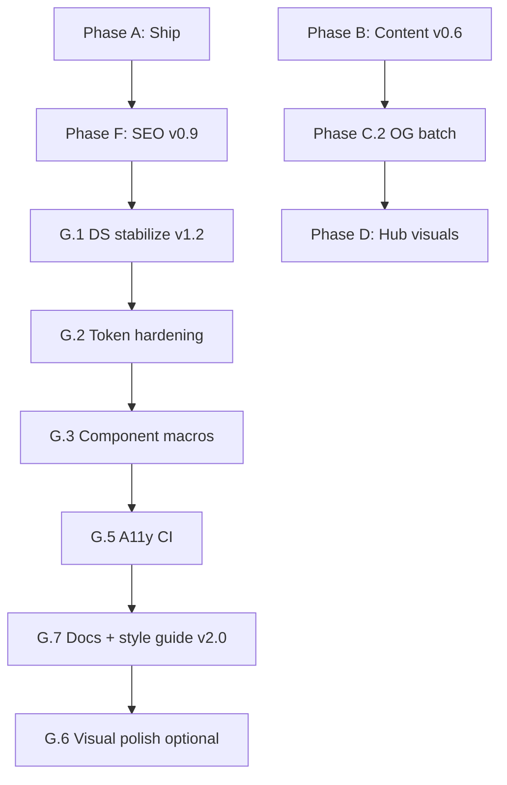

# Prompt Anatomy Blog — Roadmap & TODO

Living backlog for **promptanatomy.blog**. Update checkboxes as work completes; mirror release notes in [`CHANGELOG.md`](CHANGELOG.md).

**Last reviewed:** 2026-06-04  
**Current baseline:** v0.9.0 SEO + **Design System v2.0.0** shipped locally ([`CHANGELOG.md`](CHANGELOG.md) `[2.0.0]`). **Pending:** production deploy (pillar `og.png` 404 until v0.8+ assets live), social debugger sign-off (A.2 / F.1), git tag `v2.0.0`.

---

## How to use this file

| Symbol | Meaning |
|--------|---------|
| `[ ]` | Not started |
| `[~]` | In progress |
| `[x]` | Done |
| **P0** | Blocker / ship first |
| **P1** | High editorial or brand impact |
| **P2** | Scalability / polish |
| **P3** | Optional / when asked |

**Pre-ship gate (every phase):**

```bash
npm run build:satori          # if illustrations or data/og/ changed
python scripts/validate_satori_manifest.py
python scripts/validate_theme_tokens.py
python scripts/validate_brand_sync.py
python scripts/validate_content.py
python scripts/sync_illustrations.py
python -m pelican content -s publishconf.py
python scripts/verify_build_assets.py
python scripts/validate_seo_output.py
python scripts/validate_a11y_landmarks.py
# Preview: python -m http.server 8000 --directory output
```

On Windows without `make`, run the commands above in order (see [`docs/DEPLOY.md`](docs/DEPLOY.md)).

---

## Completed (reference)

- [x] **v0.2.0 — Content upgrade:** pillar rewrites, draft merges, governance Northline thread, Release 2 validation gates, hub/llms updates.
- [x] **v0.5.0 — Satori Phase 1:** five article heroes (1600×900), `og-default.png` (1200×630), `data/og/` pipeline, build wiring, docs.
- [x] **v2.0.0 — Design System hardening (G.1–G.7):** related-heading a11y, `validate_brand_sync.py`, `validate_a11y_landmarks.py`, breakpoint/motion/measure tokens, `article_card()` macro, doc split under `docs/design-system/`, style guide parity, DS governance in [`DESIGN_SYSTEM.md`](docs/DESIGN_SYSTEM.md).
- [x] **Start-here pillars:** `the-model-is-not-the-system`, `10-signs-your-company-is-vibe-prompting`, `how-to-design-an-ai-agent-workflow` — 1,200+ words, `hero_caption`, FAQ where required.

---

## Phase A — Ship baseline (P0)

**Goal:** Production reflects local v0.2.0 + v0.5.0 work.  
**Target tag(s):** `v0.2.0`, `v0.5.0` (or single combined release — pick one convention and stick to it).

### A.1 Git & release

- [x] Review diff; exclude secrets, `.env`, `__pycache__`, accidental `output/` commits.
- [x] Stage and commit: content, `data/og/`, `data/01_illustrations/Satori/*.png`, scripts, `package.json`, theme, docs, `CHANGELOG.md`.
- [x] Tag release(s) and push to `main` (`v0.5.0` single tag).
- [x] Confirm Vercel build succeeds (`scripts/vercel_build.sh` runs `build:satori`).

### A.2 Production smoke test

- [x] Home `/` — hub sections, featured card, start-here cards.
- [x] Five Satori articles (heroes + captions):
  - [x] `/articles/what-is-context-architecture/`
  - [x] `/articles/case-study-vibe-prompting-to-structured-workflow/`
  - [x] `/articles/structured-prompt-system-blueprint/`
  - [x] `/articles/multi-agent-handoff-pattern/`
  - [x] `/articles/from-prompts-to-business-outcomes/`
- [x] Fallback OG: `https://www.promptanatomy.blog/static/img/og-default.png` → 200.
- [ ] Optional: Facebook/Twitter/LinkedIn card debuggers on flagship pillar (re-test after Phase F OG URL fix).

### A.3 MWB sign-off ([`AGENTS.md`](AGENTS.md))

- [x] Home hub sections render from YAML.
- [x] Article typography / code blocks OK.
- [x] `/about/` live.
- [x] Atom feed `/feeds/all.atom.xml`.
- [x] `validate_content.py` passes (warnings OK; zero errors).
- [x] Vercel production `SITEURL` / canonical www correct.

---

## Phase B — Content Release 3 (P1)

**Goal:** Published catalog reads as a knowledge hub, not a slide archive.  
**Target release:** `v0.6.0`  
**Validator source of truth:** `python scripts/validate_content.py` (warnings below as of 2026-06-04).

### B.1 Framework depth (900+ words)

Expand prose-first; add decision criteria, one composite example, 2–4 internal links each. Set `body_locked: true` after edit.

| Slug | ~Words | Priority | Notes |
|------|--------|----------|-------|
| `memory-types-for-ai-systems` | 209 | P1 | On Framework reading path |
| `structured-prompt-system-blueprint` | 233 | P1 | Registry example exists; expand narrative |
| `evaluation-hooks-for-ai-workflows` | 294 | P1 | Sample YAML exists; expand |
| `ai-implementation-maturity-ladder` | 264 | P1 | On Framework reading path |
| `prompt-anatomy-foundations` | 174 | P2 | **Nav index** — expand lightly or document as intentional short hub page |

**Done when:** no `framework article short` warnings for P1 slugs (except foundations if kept as nav). **[x] Done (v0.6.0)** — P1 expanded; `prompt-anatomy-foundations` exempt via `content_tier: nav`.

### B.2 `hero_caption` sweep (published)

Add one-line figcaptions (what the diagram *means*, not title repeat).

| Slug | Status |
|------|--------|
| `ai-implementation-maturity-ladder` | [x] |
| `context-window-myths` | [x] |
| `handoff-rules-between-humans-and-ai` | [x] |
| `memory-types-for-ai-systems` | [x] |
| `multi-agent-handoff-pattern` | [x] |
| `prompt-anatomy-ecosystem-map` | [x] |
| `prompt-engineering-vs-ai-workflow-engineering` | [x] |
| `team-rituals-for-ai-implementation` | [x] |
| `types-of-prompts-for-business-workflows` | [x] |
| `when-ai-hallucinates-confidence` | [x] |

**Done when:** zero `published article missing hero_caption` warnings.

### B.3 Slide-deck → essay rhythm

Rewrite H2 sections to **≥80 words** where validator flags `slide-deck rhythm` (>50% of H2s too short). Batch by category:

**AI Governance playbooks (P1 — reading path)**

- [x] `ai-governance-roles-and-ownership`
- [x] `ai-risk-review-cadence`
- [x] `audit-trails-for-ai-workflows`
- [x] `data-boundaries-for-ai-agents`

**AI Agents / implementation (P1)**

- [x] `ai-outreach-with-outlook-guardrails`
- [x] `ai-tender-response-pipeline`
- [x] `ai-workflow-canvas-template`
- [x] `multi-agent-handoff-pattern`
- [x] `handoff-rules-between-humans-and-ai`
- [x] `team-rituals-for-ai-implementation`

**Other published (P2)**

- [x] `case-study-vibe-prompting-to-structured-workflow`
- [x] `from-prompts-to-business-outcomes`
- [x] `evaluation-hooks-for-ai-workflows`
- [x] `prompt-engineering-vs-ai-workflow-engineering`
- [x] `structured-prompt-system-blueprint`
- [x] `types-of-prompts-for-business-workflows`
- [x] `when-ai-hallucinates-confidence`
- [x] `your-company-does-not-need-more-ai-tools`

### B.4 Draft hygiene

**Merge redirects (keep `status: draft`, minimal body + canonical intent):**

- [x] `prompt-anatomy-workflow-basics` → canvas template
- [x] `context-layers-in-prompt-design` → context architecture
- [x] `from-prompt-to-agent` → agent workflow guide
- [x] `implementation-notes-hero-structure` → ecosystem map

**Implementation Notes drafts (publish or kill — decide once):**

- [x] `ai-bot-for-research-scraping` — kill → redirect stub
- [x] `telegram-bot-for-ops-alerts` — kill → redirect stub
- [x] `twitter-engagement-bot-with-limits` — kill → redirect stub
- [x] `prompt-engineering-memes-vs-reality` — keep draft redirect
- [x] `what-your-ai-stack-reveals` — kill → redirect stub
- [x] `why-structured-ai-beats-more-tools` — kill → redirect stub
- [x] `prompt-anatomy-framework-overview` — kill → redirect stub

### B.5 Release 3 docs

- [x] [`CHANGELOG.md`](CHANGELOG.md) — `[0.6.0]` entry.
- [x] [`docs/CONTENT_STANDARDS.md`](docs/CONTENT_STANDARDS.md) — `nav` tier exempt from Framework 900-word minimum (deck rhythm remains warnings).

---

## Phase C — Satori Phase 2 (P2)

**Goal:** Scalable on-brand images for new posts + better social crops for pillars.  
**Target releases:** `v0.7.0` (2a), `v0.8.0` (2b) — or combined.

### C.1 Template library (2a) — *recommended before 2b*

- [x] Design **category-default** Satori layouts (parametric per category):
  - Framework, AI Agents, AI Governance, Implementation Notes, Case Studies, Templates, Opinion
- [x] Add `data/og/templates/category-default.mjs` (shared parametric template).
- [x] Extend [`scripts/new_post.py`](scripts/new_post.py) to set `generator: satori`, `template`, `source: Satori/{slug}.png` in new manifest rows.
- [x] Document in [`AGENTS.md`](AGENTS.md) + [`data/01_illustrations/README.md`](data/01_illustrations/README.md).
- [x] Playground-first workflow note in [`docs/VISUAL_QA.md`](docs/VISUAL_QA.md).

### C.2 Per-article OG PNG (2b)

**Problem:** Article pages use 1600×900 heroes; social platforms crop to 1200×630 from center.

- [x] Add `article-og.mjs` variant via `articleOgFrame` in `base.mjs` at 1200×630.
- [x] Extend manifest: `usage: [hero, og]` → generate `Satori/{slug}-og.png` + sync to `content/images/.../og.png`.
- [x] Wire article OG/Twitter blocks to prefer dedicated OG when slug in `OG_ARTICLE_SLUGS`.
- [x] **First candidates** (already `usage: [hero, og]` in manifest):
  - [x] `the-model-is-not-the-system`
  - [x] `how-to-design-an-ai-agent-workflow`
- [x] **Batch OG:** all 27 published articles via [`scripts/batch_add_og_usage.py`](scripts/batch_add_og_usage.py)
- [x] **Homepage + topic OG:** `homepage-og.mjs`, `category-og.mjs`, `images/hub/og.png`, `images/topics/{slug}/og.png`

### C.3 Selective hero upgrades (optional)

Replace generic Basic/Governance art where metaphor is weak — only when content rewrites land:

- [ ] `memory-types-for-ai-systems` (Governance `memory_types.png`)
- [ ] `prompt-anatomy-foundations` (Basic 116)
- [ ] Memes-backed opinion pieces — **keep** unless brand tone shifts

**Explicitly out of scope (Phase 2):** favicons (stay Pillow), full Memes/Governance illustrated masters, dual-file churn without template library.

---

## Phase D — Hub & homepage visuals (P2)

- [x] Review [`data/01_illustrations/h1.png`](data/01_illustrations/h1.png) / [`Ecosystem2.png`](data/01_illustrations/Ecosystem2.png) vs live hub.
- [x] Optional Satori **frame** for homepage hero (embed existing diagram raster inside brand band).
- [x] Align [`data/hub_sections.yaml`](data/hub_sections.yaml) `hero.image_alt` with final asset.
- [x] Run [`docs/VISUAL_QA.md`](docs/VISUAL_QA.md) homepage + ecosystem checklist (items documented; sign-off table for release).

---

## Phase E — Product & SEO (P3 — when asked)

Not in MWB. Track ideas only; do not start without explicit request.

- [ ] Full-text search (Pagefind or similar)
- [ ] Newsletter provider + form backend
- [ ] Comments (Giscus)
- [ ] Register blog spoke in mother repo ecosystem manifest

---

## Phase F — SEO / GEO hardening (P0–P2) — v0.9.0

**Goal:** Second-pass audit fixes — social preview URLs, schema quality, topic reading paths, AI discovery.  
**Reference:** SEO audit 2026-06-04.

### F.1 P0 — Release blockers

- [x] Fix article `og:image` / `twitter:image` URL whitespace ([`macros/ui.html`](theme/promptanatomy/templates/macros/ui.html), [`meta_og_image.html`](theme/promptanatomy/templates/partials/meta_og_image.html))
- [x] Fix hero card `src` whitespace ([`hero_image_url`](theme/promptanatomy/templates/macros/ui.html) macro)
- [x] Article JSON-LD `description` striptags + `inLanguage` ([`schema_article.html`](theme/promptanatomy/templates/partials/schema_article.html))
- [x] Post-build [`validate_seo_output.py`](scripts/validate_seo_output.py) in Makefile + Vercel build
- [~] Production smoke: `/sitemap.xml` ✓, `/feeds/all.atom.xml` ✓, article `og.png` → **404 until deploy** (local build OK)

### F.2 P1 — Trust + internal linking

- [x] `seo_robots: noindex` on placeholder [`privacy.md`](content/pages/privacy.md) / [`terms.md`](content/pages/terms.md)
- [x] Sitemap excludes privacy/terms ([`generate_sitemap.py`](scripts/generate_sitemap.py))
- [x] Expand [`about.md`](content/pages/about.md) + Person/ProfilePage schema ([`schema_person_about.html`](theme/promptanatomy/templates/partials/schema_person_about.html))
- [x] Wire [`reading_path`](theme/promptanatomy/templates/partials/reading_path.html) on topic pages ([`category.html`](theme/promptanatomy/templates/category.html))
- [x] `CollectionPage` JSON-LD on topics ([`schema_collection.html`](theme/promptanatomy/templates/partials/schema_collection.html))
- [x] `article:modified_time` Open Graph tag ([`article.html`](theme/promptanatomy/templates/article.html))
- [x] Reading paths for all eight topics ([`categories.yaml`](data/categories.yaml))

### F.3 P2 — GEO + rich results

- [x] Expand [`llms.txt`](content/extra/llms.txt) — full topic URLs, ecosystem map, Atom feed, blog vs `.app`
- [x] AI crawler allow stanzas in [`robots.txt`](content/extra/robots.txt)
- [x] FAQ frontmatter on five playbooks (governance, boundaries, eval, foundations, maturity ladder)

### F.4 P3 — Deferred (when asked)

- [ ] Real Privacy Policy + Terms (remove noindex, re-add to sitemap)
- [ ] Self-host Inter fonts (CWV)
- [ ] WebP `<picture>` for heroes
- [ ] Dedicated About OG image (Satori)
- [ ] Remaining [`docs/SEO_improvement.md`](docs/SEO_improvement.md) P3 items

**Done when:** `validate_seo_output.py` passes; social debuggers show images on pillar URL; GSC sitemap resubmitted.

---

## Phase G — Design System hardening (v1.1 → v2.0) — **Done locally (v2.0.0)**

**Goal:** Harden, consolidate, and govern the existing design system — **no radical redesign**. Preserve hybrid light reading + dark bands, gold CTAs, blue prose links, Pelican + Jinja architecture, and Satori hero/OG pipeline.

**Reference:** Design system audit 2026-06-04 (repo evidence). Canonical spec: [`docs/DESIGN_SYSTEM.md`](docs/DESIGN_SYSTEM.md) (**v2.0**); child docs in [`docs/design-system/`](docs/design-system/).

**Shipped:** G.1–G.3, G.5, G.7 complete; G.4 partial (grid docs + hero dimensions); G.2.5/G.6 deferred.

**Target release:** `[2.0.0]` in CHANGELOG — **tag + deploy pending**.

**Pre-ship gate (theme phases):** run full gate above + [`docs/VISUAL_QA.md`](docs/VISUAL_QA.md) on `/`, one long article, `/topics/framework/`, `/about/`, `/design-system/`.

### G.0 Priority matrix (audit summary)

| Priority | Items |
|----------|--------|
| **Must fix before v2.0** | ~~Related-articles `heading_id`~~ ✓ · ~~version label alignment~~ ✓ · ~~`tokens.css` ↔ `brand.mjs` sync~~ ✓ · ~~`aria-labelledby` audit~~ ✓ |
| **Should fix soon** | ~~Style guide coverage~~ ✓ · ~~breakpoint tokens~~ ✓ · ~~card interaction models~~ ✓ · production OG smoke after deploy · ~~dark-section link selector~~ ✓ |
| **Nice to have** | ~~Motion duration tokens~~ ✓ · `--color-success` / `--color-warning` in style guide ✓ · visual regression (Playwright) · self-host Inter · category accents in CSS (G.2.5) |
| **Avoid now** | Tailwind/React migration; unify logo `#fbd304` with `#cfa73a` without mother repo; featured card multi-link; parallax / heavy animation |
| **Next (post-v2.0)** | Expand Definition of Done (10-section release contract); axe-core CLI optional gate |

---

### G.1 Stabilize and document (P0) — v1.2 lock

**Goal:** Single truth on DS version, close known a11y gap, align agent docs.  
**Risk:** Low · **Est.:** 0.5–1 day

#### G.1.1 Immediate fixes (do first this week)

- [x] **Fix related-articles landmark:** `heading_id='related-heading'` in [`related_articles.html`](theme/promptanatomy/templates/partials/related_articles.html).
- [x] **Version label alignment:** **v2.0** in [`AGENTS.md`](AGENTS.md), [`.cursor/rules/design-system.mdc`](.cursor/rules/design-system.mdc), [`docs/DESIGN_SYSTEM.md`](docs/DESIGN_SYSTEM.md), [`.cursor/agents/q-and-a-agent.md`](.cursor/agents/q-and-a-agent.md), [`README.md`](README.md), [`docs/ARCHITECTURE.md`](docs/ARCHITECTURE.md).
- [~] **Production smoke (carry-over):** sitemap + Atom ✓; pillar `og.png` pending deploy; social debuggers on `/` + one pillar still open ([`docs/VISUAL_QA.md`](docs/VISUAL_QA.md)).

#### G.1.2 `aria-labelledby` audit (all partials)

For every `<section … aria-labelledby="…">`, confirm `section_heading(…, heading_id='…')` (or equivalent `id` on `h2`).

| Partial | `aria-labelledby` | `heading_id` set? | Action |
|---------|-------------------|-------------------|--------|
| `related_articles.html` | `related-heading` | Yes | Fixed G.1.1 |
| `faq.html` | `faq-heading` | Yes | — |
| `article_cta.html` | `article-cta-heading` | Yes | — |
| `featured_article.html` | `featured-heading` | Yes | — |
| `blog_hero.html` | `hero-heading` | Yes (`h1` id) | Verified |
| `topic_cluster_grid.html` | `topics-heading` | Yes (3rd arg) | — |
| `ecosystem_spoke.html` | `ecosystem-heading` | Yes | — |
| `newsletter_cta.html` | `newsletter-heading` | Yes | — |
| `start_here_cards.html` | `start-here-heading` | Yes | — |
| `reading_path.html` | `reading-path-heading` | Yes | — |
| `index.html` (latest) | `latest-heading` | Yes | — |
| `template_download.html` | `templates-heading` | Yes | — |
| `style_guide.html` | per-section | Yes | — |

- [x] Walk table above on built `output/` HTML — `validate_a11y_landmarks.py` passes (41 files).
- [x] Post-build check: [`scripts/validate_a11y_landmarks.py`](scripts/validate_a11y_landmarks.py) wired in `make build` + Vercel.

#### G.1.3 Document known brand exceptions

- [x] [`docs/design-system/BRAND_EXCEPTIONS.md`](docs/design-system/BRAND_EXCEPTIONS.md) — logo bolt, theme-color, inline hex, dual maintenance workflow.
- [x] Dual maintenance documented; enforced by `validate_brand_sync.py` (G.2.1).

#### G.1.4 Sign-off

- [x] Sign-off row in [`docs/VISUAL_QA.md`](docs/VISUAL_QA.md) for DS v2.0.0.
- [x] [`CHANGELOG.md`](CHANGELOG.md) — `[2.0.0]` entry (consolidates planned v1.2–v1.4 slices).

**Done when:** ~~no `aria-labelledby` without matching heading `id`~~ ✓; ~~version strings match~~ ✓; production OG smoke checked or ticketed — **partial (deploy pending)**.

---

### G.2 Token hardening (P1)

**Goal:** One brand source of truth; tokenize breakpoints and motion; reduce CSS/Satori drift.  
**Risk:** Medium · **Files:** `tokens.css`, `brand.mjs`, `base.css`, `layout.css`, `components.css`, `article.css`, new `scripts/validate_brand_sync.py`

#### G.2.1 Brand sync validation (before renaming colors)

- [x] Create [`scripts/validate_brand_sync.py`](scripts/validate_brand_sync.py).
- [x] Wire into `Makefile` `validate` target (after `validate-theme`) + [`scripts/vercel_build.sh`](scripts/vercel_build.sh).
- [x] Document workflow in [`AGENTS.md`](AGENTS.md).

#### G.2.2 Breakpoint tokens

- [x] Added to `tokens.css`: `--bp-table`, `--bp-nav-max`, `--bp-nav`, `--bp-toc-max`, `--bp-toc`.
- [x] `@media` literals annotated in `layout.css`, `components.css`, `article.css` (CSS cannot use `var()` in media queries).
- [x] Breakpoint table in [`docs/DESIGN_SYSTEM.md`](docs/DESIGN_SYSTEM.md) + [`docs/design-system/TOKENS.md`](docs/design-system/TOKENS.md).

#### G.2.3 Motion tokens

- [x] `--duration-fast`, `--duration-normal`, `--ease-standard` in `tokens.css`.
- [x] Replaced repeated transitions in `components.css`.
- [x] `prefers-reduced-motion` in `base.css` unchanged.

#### G.2.4 Layout measure tokens (magic numbers)

- [x] `--measure-hero-headline`, `--measure-hero-subhead`, `--measure-ecosystem-intro`, `--measure-newsletter-form`, `--article-cta-max`, `--touch-target-min`.
- [x] Applied in `components.css` / `article.css`; documented in TOKENS.md.

#### G.2.5 Category accent colors (optional in v1.2)

- [ ] Export `categoryStyles` from shared JSON or generate `brand.mjs` from `tokens.css` — **deferred**.
- [ ] `--color-category-*` tokens for eight Pelican categories — P2.

#### G.2.6 Reserved tokens

- [x] `--color-success` / `--color-warning` shown on `/design-system/` (style guide only).

**Done when:** ~~`validate_brand_sync.py` passes in CI~~ ✓; ~~breakpoints/motion use tokens~~ ✓; CHANGELOG notes token changes ✓.

---

### G.3 Component consolidation (P1–P2)

**Goal:** Unified macro APIs for cards without changing UX rules (featured = single gold CTA; start-here = stretched link; article list = thumb + title links).  
**Risk:** Medium–high · **Files:** `macros/ui.html` (or new `macros/cards.html`), `article_card.html`, `topic_cluster_grid.html`, `components.css`, [`docs/COMPONENT_MAP.md`](docs/COMPONENT_MAP.md)

#### G.3.1 Document interaction models (do before code)

- [x] **Card interaction models** in [`docs/DESIGN_SYSTEM.md`](docs/DESIGN_SYSTEM.md) + [`docs/design-system/COMPONENTS.md`](docs/design-system/COMPONENTS.md).

#### G.3.2 Macros (incremental)

- [x] `article_card(article)` macro in [`macros/ui.html`](theme/promptanatomy/templates/macros/ui.html).
- [x] Updated `related_articles.html`, `index.html`, `category.html` to use macro; [`partials/article_card.html`](theme/promptanatomy/templates/partials/article_card.html) is thin wrapper.
- [ ] (Optional) `topic_card(cat)` macro — deferred.
- [x] Featured card kept separate from generic `card()`.

#### G.3.3 Dark-section link selector

- [x] Refactored [`layout.css`](theme/promptanatomy/static/css/layout.css) — `.section--dark .prose a`, `.link--on-dark`, shortened `:not()` chain.

**Done when:** ~~`article_card` macro everywhere~~ ✓; ~~COMPONENT_MAP updated~~ ✓; ~~card models documented~~ ✓.

---

### G.4 Layout and responsive standardization (P2) — partial

- [x] Grid `minmax` constants documented in [`docs/design-system/TOKENS.md`](docs/design-system/TOKENS.md).
- [x] Hub hero `width`/`height` on [`blog_hero.html`](theme/promptanatomy/templates/partials/blog_hero.html) image.
- [ ] Full `@media` audit spreadsheet (remaining literals OK — CSS limitation).
- [ ] Manual verify article layout at 375px / 768px / 1280px per VISUAL_QA before production tag.

---

### G.5 Accessibility and semantic hardening (P1) — **Done**

- [x] [`scripts/validate_a11y_landmarks.py`](scripts/validate_a11y_landmarks.py) on built `output/`.
- [x] Wired in `make build` + Vercel (post-Pelican).
- [x] FAQ styles in [`article.css`](theme/promptanatomy/static/css/article.css); keyboard note in VISUAL_QA.
- [x] Article card thumb `tabindex="-1"` + `aria-hidden="true"` preserved in macro.
- [ ] (Optional) axe-core CLI on 4 URLs.

**Done when:** ~~landmark validator passes in CI~~ ✓; FAQ keyboard in VISUAL_QA ✓.

---

### G.6 Visual polish and brand refinement (P3 — when asked)

**Goal:** Asset and CWV polish without redesign. **Do not block v2.0.**

- [ ] Selective hero upgrades ([`todo.md`](todo.md) Phase C.3): `memory-types-for-ai-systems`, `prompt-anatomy-foundations`
- [ ] Self-host Inter ([`todo.md`](todo.md) Phase F.4) — reduces Google Fonts dependency
- [ ] WebP `<picture>` for article heroes — weight only; keep PNG fallback
- [ ] Dedicated About OG (Satori) — trust/social
- [ ] Align Satori `categoryStyles` tints with ecosystem card colors (`--color-ecosystem-1..4`) — cosmetic consistency only

**Done when:** requested by editorial/brand; each item has VISUAL_QA + Satori regen sign-off.

---

### G.7 Documentation and governance (P1 — v2.0.0 gate)

**Goal:** v2.0 doc structure + contribution rules + style guide = contract.  
**Risk:** Low · **Maintainer:** [q-and-a-agent](.cursor/agents/q-and-a-agent.md)

#### G.7.1 Doc structure (suggested)

- [x] [`docs/DESIGN_SYSTEM.md`](docs/DESIGN_SYSTEM.md) — index, principles, versioning v2.0, link to children
- [x] [`docs/design-system/TOKENS.md`](docs/design-system/TOKENS.md)
- [x] [`docs/design-system/COMPONENTS.md`](docs/design-system/COMPONENTS.md)
- [x] [`docs/design-system/LAYOUT.md`](docs/design-system/LAYOUT.md)
- [x] [`docs/design-system/MOTION.md`](docs/design-system/MOTION.md)
- [x] [`docs/design-system/BRAND_EXCEPTIONS.md`](docs/design-system/BRAND_EXCEPTIONS.md)
- [x] [`docs/COMPONENT_MAP.md`](docs/COMPONENT_MAP.md) updated (`article_card` macro)

#### G.7.2 Style guide parity (`/design-system/`)

- [x] `topic-card`, `ecosystem-card`, `article_card` (with/without thumb), `breadcrumb`, `article-cta`, `reading-path`, FAQ, prose table, `reading-progress` note
- [x] `key_takeaway` + `article-lead` (prior release)

#### G.7.3 Governance rules

- [x] DS semver + color workflow in DESIGN_SYSTEM.md
- [x] [`.cursor/rules/design-system.mdc`](.cursor/rules/design-system.mdc) → v2.0

#### G.7.4 v2.0.0 release

- [ ] Git tag **`v2.0.0`** (or DS-specific tag) after deploy smoke
- [x] [`CHANGELOG.md`](CHANGELOG.md) — `[2.0.0]` summary

**Done when:** ~~style guide ~95% COMPONENT_MAP~~ ✓; ~~brand sync in CI~~ ✓; contribution rules in AGENTS + DESIGN_SYSTEM ✓.

#### G.7.5 Definition of Done expansion (post-v2.0 — draft reviewed)

- [ ] Replace short DoD checklist in DESIGN_SYSTEM with 10-section release contract (CI vs manual QA vs major-only)
- [ ] Cross-link DoD §3–§6 to `VISUAL_QA.md` + `CONTENT_STANDARDS.md`
- [ ] Add `(CI)` / `(QA)` / `(Major)` labels to avoid false “all done forever” checkboxes

---

### G.8 DS implementation checklist (developer quick list)

**Order of execution (safe path):** — **completed 2026-06-04**

1. ~~G.1.1 related-articles `heading_id` + version strings~~ ✓  
2. ~~G.1.2 aria audit + G.1.3 brand exceptions doc~~ ✓  
3. ~~G.2.1 `validate_brand_sync.py`~~ ✓  
4. ~~G.2.2–G.2.4 breakpoint / motion / measure tokens~~ ✓  
5. ~~G.3.1 card models doc → G.3.2 `article_card()` macro~~ ✓  
6. ~~G.5 landmark validator~~ ✓  
7. ~~G.7.2 style guide expansion → G.7.1 doc split~~ ✓  
8. ~~G.3.3 dark-section links~~ ✓  
9. G.6 / visual regression — when asked  
10. G.7.5 expanded DoD — next doc task  

**Regression prevention (every theme PR):**

- [ ] No hex outside [`tokens.css`](theme/promptanatomy/static/css/tokens.css)
- [ ] `brand.mjs` updated if brand colors changed → regen Satori
- [ ] Partial rename → [`COMPONENT_MAP.md`](docs/COMPONENT_MAP.md) + style guide
- [ ] Do not reorder [`article.html`](theme/promptanatomy/templates/article.html) blocks without [`CONTENT_STANDARDS.md`](docs/CONTENT_STANDARDS.md) review

| Release | Phase G | Focus | Status |
|---------|---------|-------|--------|
| v1.2.0 | G.1 (+ smoke) | a11y fix, version alignment, brand exceptions | Merged into `[2.0.0]` |
| v1.3.0 | G.2 | brand sync validator, breakpoint/motion tokens | Merged into `[2.0.0]` |
| v1.4.0 | G.3 + G.5 | article_card macro, landmark CI | Merged into `[2.0.0]` |
| v2.0.0 | G.4 + G.7 | layout docs, doc split, style guide parity | **Local ✓ — tag/deploy pending** |

---

## Suggested execution order



**Active track (2026-06):**

1. **Deploy + smoke** — push to Vercel; re-check pillar `og.png` → 200; social debuggers (A.2 / F.1).
2. **Tag `v2.0.0`** — after production smoke passes.
3. **G.7.5** — expand Definition of Done (10-section contract with CI/QA labels).
4. **G.4 manual QA** — 375 / 768 / 1280px spot-check per VISUAL_QA before tag.
5. **Phase C.3 / G.6** — selective hero upgrades + CWV (**when asked**).
6. **Phase E** — product features (**do not start** without explicit request).

---

## Quick reference

| Doc | Purpose |
|-----|---------|
| [`AGENTS.md`](AGENTS.md) | Agent workflows, frontmatter contract |
| [`docs/DESIGN_SYSTEM.md`](docs/DESIGN_SYSTEM.md) | Design system v2.0 spec + index; child docs in `docs/design-system/` |
| [`docs/COMPONENT_MAP.md`](docs/COMPONENT_MAP.md) | Brief → Jinja partial mapping |
| [`docs/CONTENT_STANDARDS.md`](docs/CONTENT_STANDARDS.md) | Voice, publish checklist |
| [`docs/ARCHITECTURE.md`](docs/ARCHITECTURE.md) | Build pipeline incl. Satori |
| [`docs/DEPLOY.md`](docs/DEPLOY.md) | Vercel, local build without make |
| [`docs/VISUAL_QA.md`](docs/VISUAL_QA.md) | Pre-release visual + a11y checklist |
| [`data/illustrations.yaml`](data/illustrations.yaml) | Hero manifest + `generator: satori` |
| [`theme/promptanatomy/static/css/tokens.css`](theme/promptanatomy/static/css/tokens.css) | Color/type/spacing token source of truth |
| [`data/og/brand.mjs`](data/og/brand.mjs) | Satori brand mirror (keep in sync with tokens) |
| [`scripts/validate_brand_sync.py`](scripts/validate_brand_sync.py) | CSS ↔ Satori brand color sync |
| [`scripts/validate_a11y_landmarks.py`](scripts/validate_a11y_landmarks.py) | Post-build `aria-labelledby` / `id` check |

**Satori slugs today (Phase 1):**  
`what-is-context-architecture`, `case-study-vibe-prompting-to-structured-workflow`, `structured-prompt-system-blueprint`, `multi-agent-handoff-pattern`, `from-prompts-to-business-outcomes`

**Start-here slugs (homepage):**  
`the-model-is-not-the-system`, `10-signs-your-company-is-vibe-prompting`, `how-to-design-an-ai-agent-workflow`

---

## Changelog mapping

| Release | Phase | Focus |
|---------|-------|-------|
| v0.2.0 | — | Content upgrade (done) |
| v0.5.0 | C (partial) | Satori Phase 1 (done) |
| v0.6.0 | B | Content Release 3 |
| v0.7.0 | C.1 | Satori category templates |
| v0.8.0 | C.2 + D + SEO | Batch OG all published + hub/topic OG |
| v0.9.0 | F | SEO/GEO hardening — OG URL fix, reading paths, llms.txt, schema |
| v2.0.0 | G.1–G.7 | DS hardening — a11y CI, brand sync, tokens, macros, doc split, style guide (**local ✓**) |
| — | G.7.5 | Expanded DoD 10-section release contract (planned) |
